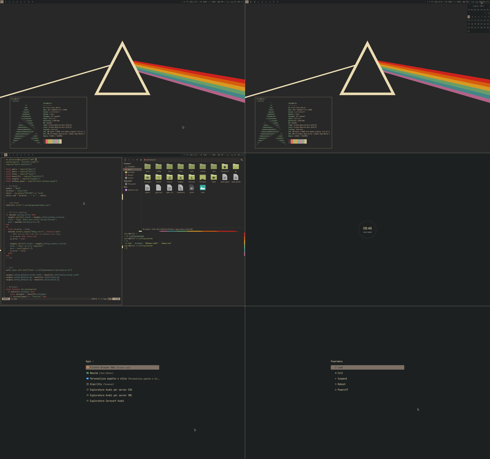

# dotfiles

## what i use
awesomewm, i3lock-color, xss-lock, maim, rofi, thunar, alacritty, fish, Iosevka Nerd Font Mono,
iwd, brightnessctl, pactl (pulseaudio), pavucontrol, feh, lxappearance, file-roller,
neovim, Simp1e-Gruvbox-Dark cursor, gruvbox-material (gtk, icons, colorscheme).

## preview

